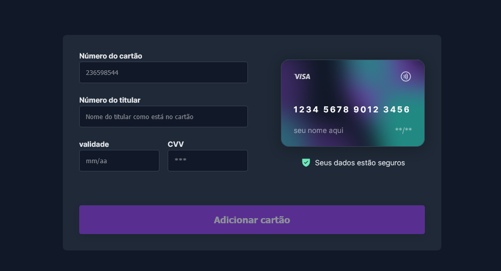
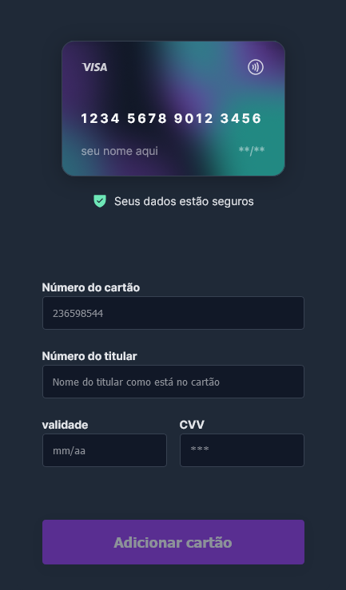

<h1 align="center">Cartão de crédito</h1>

- [Acesse o projeto finalizado, online](https://bora-codar-xi.vercel.app/desafio13/index.html)

  

  

 
## 🚀 Tecnologias

Esse projeto foi desenvolvido com as seguintes tecnologias:

- HTML 
- CSS
- JS
- Git e Github
- Figma
   
## 💻 Projeto
Cartão de crédito, desafio13 da comunidade rocketseat sugerido pelo professor Mayk Brito dentro da #BoraCodar
    
## 🔖 Layout

Você pode visualizar o layout do projeto através [DESSE LINK](https://www.figma.com/community/file/1222904930776225825). É necessário ter conta no [Figma](https://figma.com) para acessá-lo.